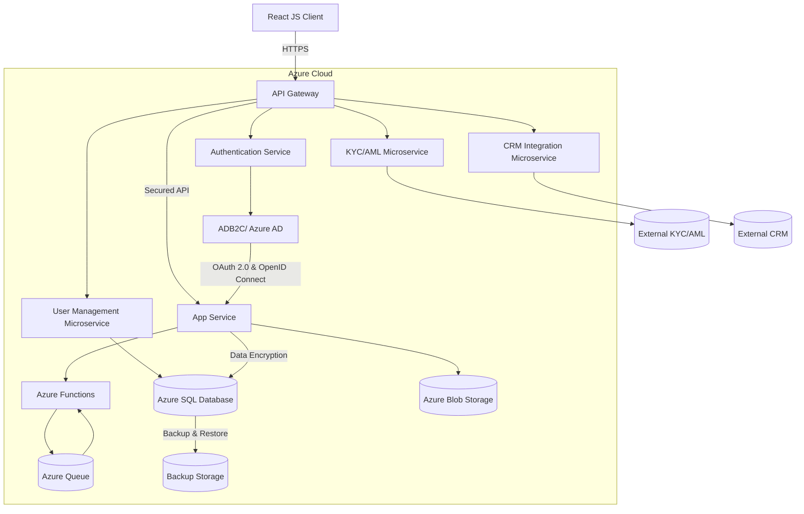

# Architecture Design - fin-demo01182026-1

**Generated:** 2026-01-18 17:14:04

**Confidence:** high
**Iterations:** 1
**Spawned Agents:** 0

---

### Architecture Summary for Wealth and Asset Management Firm Onboarding and Registration Solution

The proposed architecture for the onboarding and registration solution for a wealth and asset management firm leverages Azure as the cloud platform, incorporating React JS for the frontend and Java Spring Boot for backend microservices. The system emphasizes security, scalability, and performance, adhering to Northern Trust's technical standards. The architecture includes Azure App Service for hosting the application, Azure SQL for database management, and Azure Functions for serverless computing tasks. OAuth 2.0 and OpenID Connect ensure secure API access, while Azure Active Directory (AAD) provides robust identity and access management with multi-factor authentication. The solution integrates with existing CRM and KYC/AML systems, ensuring compliance with financial regulations. The deployment leverages Azure DevOps for CI/CD, ensuring continuous integration and delivery with automated security checks and testing.

### Mermaid Diagram

This Mermaid diagram represents the high-level system architecture, showing the interaction between various components within the Azure cloud environment. Each component is designed to ensure secure, scalable, and performant operation, from user authentication to data storage and integration with external systems.