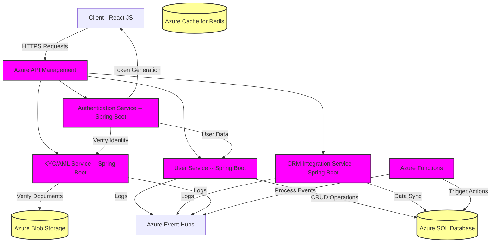

# Architecture Design - fin-demo01182026-2

**Generated:** 2026-01-18 17:33:31

**Confidence:** high
**Iterations:** 1
**Spawned Agents:** 0

---

### Architecture Summary
The proposed solution for the Wealth and Asset Management Firm Onboarding and Registration System is designed to fulfill the stringent requirements of security, scalability, and performance. It leverages Azure-native services to create a robust, scalable cloud infrastructure that supports high concurrency and data security. The frontend is built using React JS, ensuring a responsive and modern user interface, while the backend is powered by Java-based microservices using Spring Boot, optimized for performance and scalability. Security is enforced through OAuth 2.0 for authentication, along with Azure's identity management services for robust access control and MFA. The system integrates seamlessly with external KYC/AML services for identity verification and with existing CRM systems for data synchronization. Compliance with financial regulations is ensured throughout the design.

### Mermaid Diagram: High-Level Architecture

This diagram represents the system architecture utilizing Azure services and Spring Boot microservices, ensuring secure and efficient processing and storage of user data while supporting seamless integration with external systems.