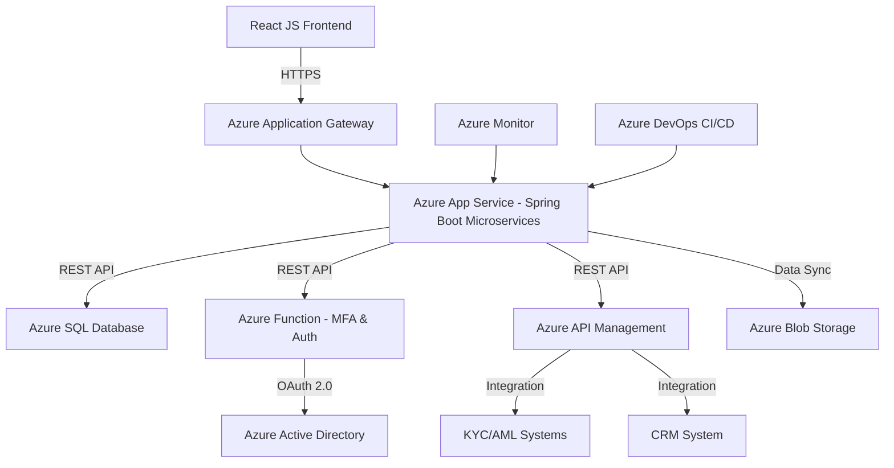

# Architecture Design - fin-demo01182026-4

**Generated:** 2026-01-18 17:54:14

**Confidence:** very_high
**Iterations:** 1
**Spawned Agents:** 0

---

### Architecture Summary
The architecture for the digital onboarding and registration platform is designed to be secure, scalable, and compliant with Northern Trust's technical standards. The system leverages Azure cloud services, employing React JS for the frontend and Java Spring Boot for the backend microservices. Authentication is managed via OAuth 2.0, with multi-factor authentication (MFA) and role-based access control (RBAC) ensuring secure access. Data is encrypted both in transit and at rest, aligning with stringent security standards. Azure DevOps is used for CI/CD, facilitating continuous integration and deployment across development, staging, and production environments. Integration with external KYC/AML and CRM systems is achieved through secure RESTful APIs, ensuring real-time data synchronization and compliance.

### High-level Architecture Diagram

### Component Breakdown with Azure Services
- **Frontend**: Hosted on Azure Blob Storage, served via Azure Content Delivery Network (CDN) for global accessibility and performance.
- **Backend**: Java Spring Boot microservices running on Azure App Service, providing business logic and API endpoints.
- **Database**: Azure SQL Database for structured data storage with built-in security and performance features.
- **Authentication & Authorization**: Azure Active Directory for identity management integrated with OAuth 2.0 for secure API access.
- **MFA & Security Functions**: Azure Functions to handle MFA operations and other security tasks.
- **API Management**: Azure API Management to interface securely with external KYC/AML and CRM systems.
- **Monitoring and Logging**: Azure Monitor and Azure Application Insights for real-time monitoring, performance metrics, and logging.

### Technology Stack
- **Frontend**: React JS
- **Backend**: Java with Spring Boot
- **Database**: Azure SQL Database
- **Security**: OAuth 2.0, Azure Active Directory, Azure Key Vault (for encryption key management)
- **DevOps**: Azure DevOps for source control, builds, and release management

### Security Architecture
- **Authentication**: Azure Active Directory with OAuth 2.0, supporting OpenID Connect for secure user authentication.
- **Authorization**: Role-Based Access Control (RBAC) defined and enforced through Azure policies.
- **Encryption**: TLS for data in transit and Azure Key Vault for encryption at rest, ensuring compliance with PCI DSS and NIST standards.

### Deployment Architecture
- **CI/CD Pipeline**: Azure DevOps is used to manage the CI/CD pipeline, automating builds, testing, and deployment across multiple environments (dev, staging, production).
- **Environments**: Separate environments in Azure for development, testing, staging, and production, each isolated to ensure security and stability.

### Data Flow Diagrams
Due to complexity, detailed data flow diagrams are not included here but would typically delineate how data moves between systems, including interactions with external systems for KYC/AML checks, CRM updates, and logging/monitoring services, ensuring clarity on data ingress and egress points.