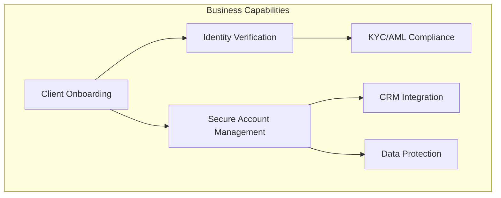
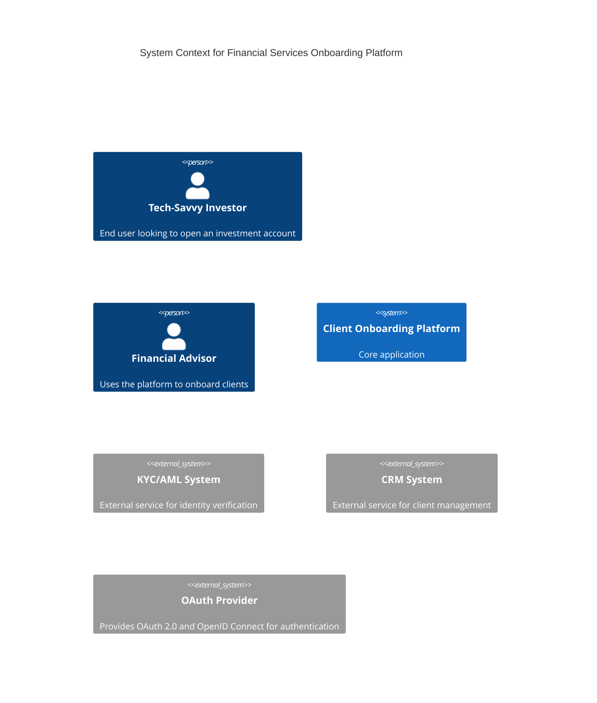
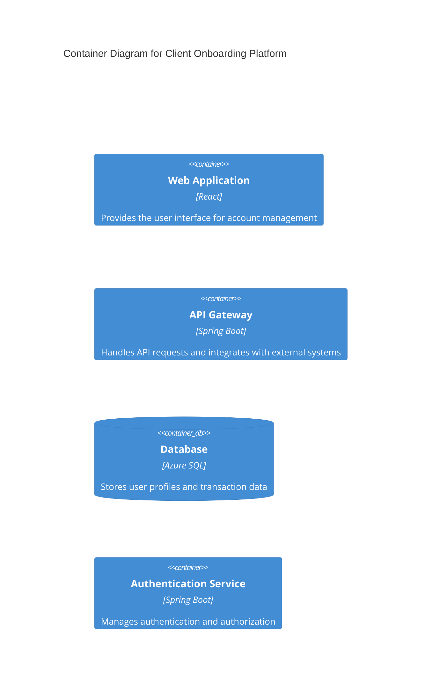
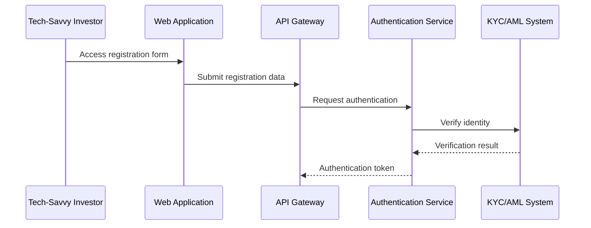
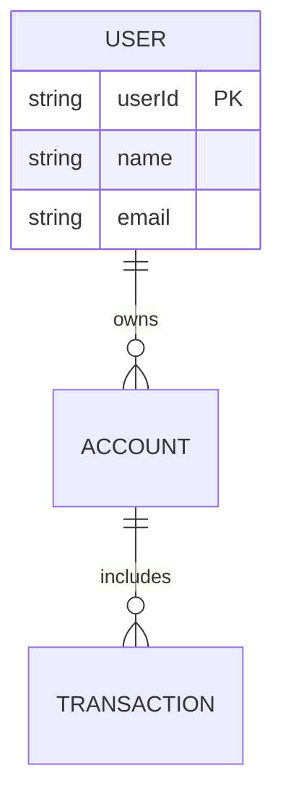
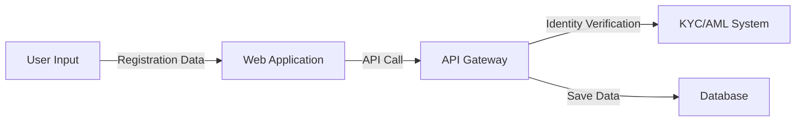

# Architecture Design - fin-demo01192026-da-1

**Generated:** 2026-01-20 00:09:53

**Confidence:** very_high
**Iterations:** 1
**Spawned Agents:** 0

---

# Architecture Design

## 1. Business Architecture
**Purpose**: Define business capabilities, value streams, and organizational structure to support the secure and efficient onboarding of clients for financial services.

**Business Context**: 
The system aims to streamline the client onboarding process in a secure financial environment, catering to tech-savvy investors and financial advisors. The primary business goals are to enhance user experience through efficient account setup, ensure rigorous security measures including MFA and encryption, and integrate seamlessly with existing KYC/AML and CRM systems. This will facilitate rapid, secure onboarding and robust client management, aligning with compliance standards like GDPR, FINRA, and SEC.

**Business Capability Map**:

## 2. Application Architecture (C4 Model)
**Purpose**: Define the main software components and their interactions within the system.

**C4 Context Diagram**:

**C4 Container Diagram**:

**Component Interaction**:

## 3. Data Architecture
**Purpose**: Outline the main data entities and their relationships while ensuring data integrity and privacy.

**Entity Relationship Diagram**:

**Data Flow Diagram**:

## 4. Technology Stack (Northern Trust Standards)
| Layer           | Technology       | Justification                              |
|-----------------|------------------|--------------------------------------------|
| Cloud Platform  | Azure            | NT standard, provides required cloud services |
| Frontend        | React JS         | NT standard for modern web applications    |
| Backend         | Java Spring Boot | Recommended for Java-based microservices   |
| Database        | Azure SQL        | Managed relational database service        |
| Authentication  | OAuth 2.0/OpenID | Ensures secure API access and user authentication |

## 5. Security Architecture (2026 SSDLC Requirements)
**Purpose**: Ensure robust security measures are in place to protect data and comply with regulatory standards.

**Security Layers**:
- Authentication: OAuth 2.0 + OpenID Connect, MFA with SMS, email, and biometric options
- Authorization: Role-Based Access Control (RBAC) integrated with Azure AD
- Encryption: TLS 1.3 for data in transit, AES-256 for data at rest
- Compliance: Adheres to PCI DSS, NIST Cybersecurity Framework, ISO 27001/27002
- Fraud Monitoring: Implements real-time behavioral analysis for anomaly detection

## 6. Deployment Architecture
**Purpose**: Describe the deployment strategy and continuous integration/continuous deployment (CI/CD) processes.

**Azure Deployment Topology**:
- Production and DR environments in separate Azure regions (e.g., East US and West US)
- Use Azure App Services for web and API hosting, with auto-scaling configured
- Azure SQL databases with geo-replication for high availability and disaster recovery

**CI/CD Pipeline**:
- Azure DevOps for source control, build, and release management
- Automated pipelines for build, test (unit, integration), security scanning, and deployment to multiple stages (dev, test, prod)

**Infrastructure Components**:
- Compute: Azure App Services with auto-scaling
- Storage: Azure SQL Database with geo-replication
- Networking: Azure Virtual Network, Azure Application Gateway with WAF
- Monitoring: Azure Monitor and Application Insights for performance and security monitoring

## 7. Scalability & Performance Strategy
- Horizontal scaling: Azure App Service Plan with autoscale setting (scale-out up to 10 instances based on load)
- Load balancing: Azure Load Balancer to distribute client requests efficiently
- Caching: Azure Redis Cache to enhance performance and reduce database load
- Database performance: Utilize Azure SQL's built-in performance optimization features

## 8. High Availability & Disaster Recovery
- SLA Target: 99.99% uptime
- RTO (Recovery Time Objective): 1 hour
- RPO (Recovery Point Objective): 5 minutes
- Multi-region deployment: Active-active configuration for critical components
- Backup Strategy: Automated backups with point-in-time restore capabilities

ARCHITECTURE_COMPLETE